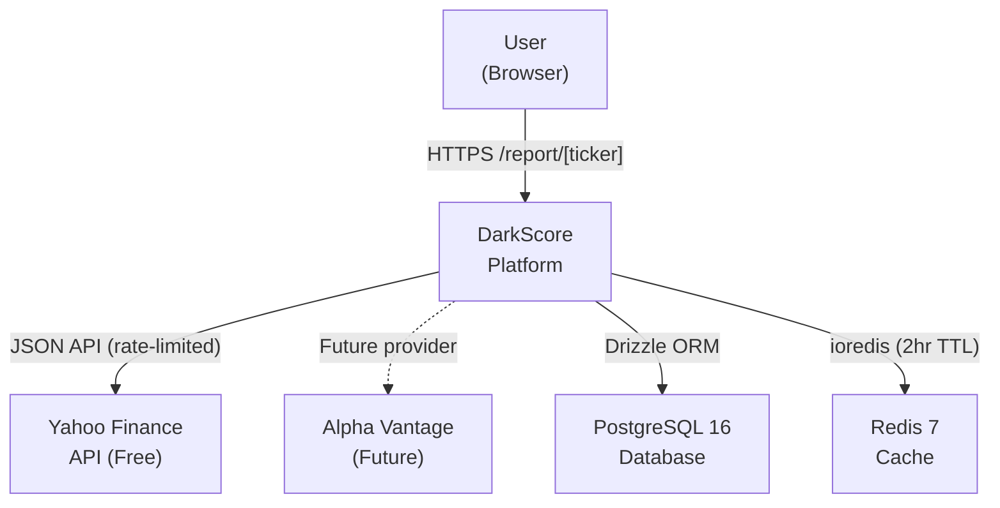
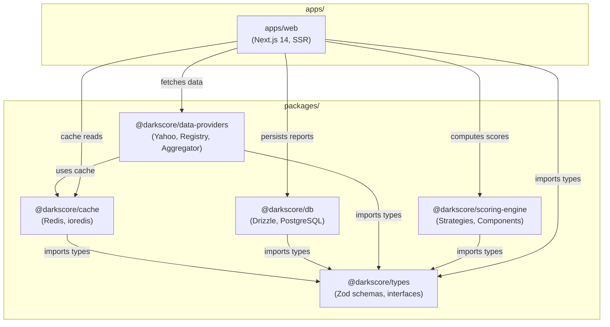
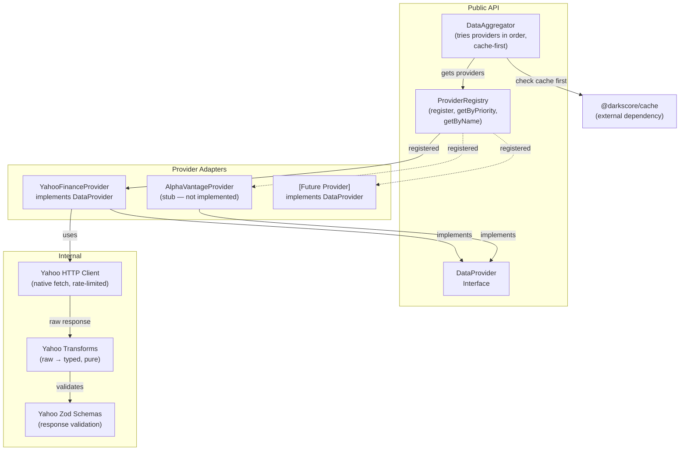
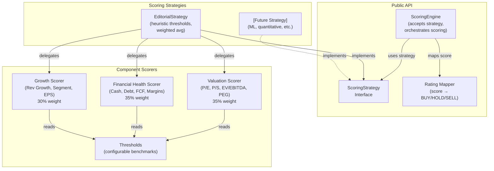

<!-- Source of truth: .specify/ directory. Maintained via spec-kit conventions. -->

# C4 Architecture Diagrams — DarkScore

These diagrams are **normative constraints**, not just documentation. Per Constitution rule C11, agents MUST read the relevant diagram before implementing a task. Any connection or dependency not shown here requires a spec amendment first.

Levels follow the [C4 model](https://c4model.com/):

- **L1 — System Context** — DarkScore and the external systems it touches
- **L2 — Container** — All packages in the monorepo and their allowed dependencies
- **L3 — Component** — Internal architecture of the two non-trivial packages (`data-providers`, `scoring-engine`)

---

## L1 — System Context

Shows DarkScore's external boundaries — what systems it talks to and what trust boundaries exist.

**Trust Boundary**: Yahoo Finance is an untrusted external source. All responses MUST be validated through Zod schemas before entering the system. Rate limiting (5 req/s) prevents abuse. Redis and Postgres are trusted internal infrastructure.

**Data Flow**: User requests a ticker → DarkScore checks Redis cache → on miss, fetches from Yahoo Finance → validates with Zod → computes risk score → stores in Postgres → caches in Redis → returns SSR HTML.

**Key constraints from this diagram:**
- Only TWO external data sources exist (Yahoo active, Alpha Vantage stubbed)
- Adding a new provider requires a spec amendment + registry update
- All external API responses enter through Zod validation (trust boundary)
- PostgreSQL and Redis are the only persistence/caching systems

---

## L2 — Container (Package Dependency Graph)

Shows all packages in the monorepo and their **allowed** dependency relationships. This diagram IS the enforcement of Constitution C4 (Package Boundaries).

**Leaf packages** (`types`) have ZERO internal dependencies. They are imported by everything but import nothing from `@darkscore/*`. `cache` and `db` depend only on `types`.

**Middleware packages** (`data-providers`, `scoring-engine`) sit between leaf packages and the app. Providers depend on `types` + `cache`. Scoring depends on `types` ONLY — it is pure computation with no I/O.

**App layer** (`web`) is the only package allowed to import from ALL other packages. It orchestrates the full flow: fetch → score → persist → render.

**FORBIDDEN connections** (not shown = not allowed): `scoring → db`, `scoring → cache`, `scoring → providers`, `cache → db`, `db → cache`, `providers → db`. Any import not shown in this diagram is a spec violation.

**Dependency rules table:**

| Package | May import from |
|---------|----------------|
| `@darkscore/types` | Nothing (leaf) |
| `@darkscore/cache` | `types` |
| `@darkscore/db` | `types` |
| `@darkscore/data-providers` | `types`, `cache` |
| `@darkscore/scoring-engine` | `types` (ONLY — pure computation) |
| `apps/web` | `types`, `cache`, `db`, `data-providers`, `scoring-engine` |

---

## L3 — Component: Data Providers (Internal Architecture)

This is the only package complex enough to warrant an L3 diagram. Shows the pluggable adapter pattern inside `@darkscore/data-providers`.

**Request flow**: Aggregator checks cache → on miss, gets providers from Registry (by priority) → calls first available provider → provider's HTTP client fetches raw data → transforms parse it → Zod schemas validate it → typed `Result<T>` returned → Aggregator caches the result.

**Adding a new provider**: 1) Create a new class implementing `DataProvider` interface, 2) Add HTTP client + transforms + Zod schemas, 3) Register in `ProviderRegistry` with a priority number. The Aggregator and rest of the system require ZERO changes.

**Key constraints from this diagram:**
- Every provider MUST implement the `DataProvider` interface
- The `Aggregator` is the ONLY public entry point — consumers never call providers directly
- Yahoo-specific code (client, transforms, schemas) is encapsulated inside `providers/yahoo/`
- Adding a new provider requires ONLY: new adapter folder + registry entry
- Cache is checked BEFORE any provider call

---

## L3 — Component: Scoring Engine (Internal Architecture)

Shows the strategy pattern inside `@darkscore/scoring-engine`.

**Scoring flow**: Engine receives financial data → delegates to active `ScoringStrategy` → Strategy calls 3 component scorers (Valuation 35%, Health 35%, Growth 30%) → each scorer uses Thresholds for benchmarks → Strategy computes weighted average → Engine inverts to risk score (`100 - avg`) → Rating mapper assigns label.

**Swapping strategies**: To add ML-based scoring, create a new class implementing `ScoringStrategy` interface. Pass it to `ScoringEngine` constructor. Component scorers and thresholds can be reused or replaced. Zero changes to the web app or data providers.

**Key constraints from this diagram:**
- `ScoringEngine` accepts a strategy — it never hardcodes one
- All component scorers read from a shared `Thresholds` config
- Strategies can reuse or replace individual component scorers
- Rating mapping is separate from scoring — it's a post-processing step
- The entire package has ZERO I/O dependencies (no cache, no db, no network)
