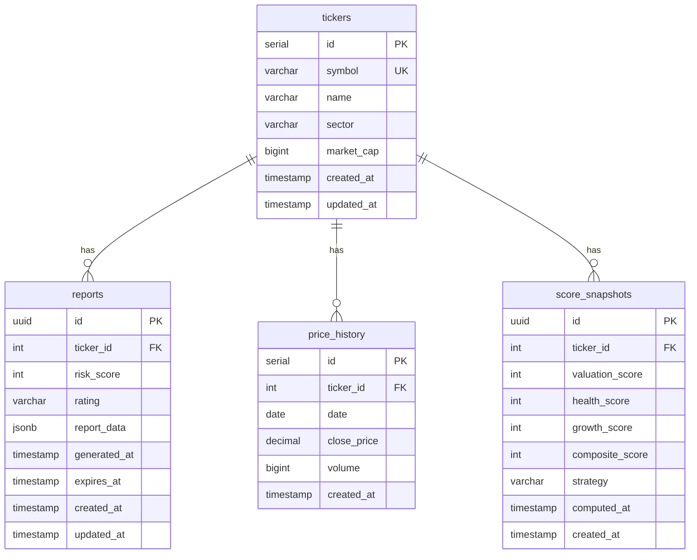

<!-- Source of truth: .specify/ directory. Maintained via spec-kit conventions. -->

# Data Model — DarkScore Foundation

The database schema is implemented with **Drizzle ORM** against **PostgreSQL 16**. All schema changes go through Drizzle migrations (Constitution C6). Every table has `created_at` and `updated_at` timestamps.

There are four tables in Phase 0:

1. `tickers` — canonical ticker registry
2. `reports` — generated risk-score report payloads
3. `price_history` — daily price points per ticker
4. `score_snapshots` — historical record of computed scores

---

## Table: `tickers`

Canonical registry of stock symbols the system has seen.

| Column | Type | Notes |
|--------|------|-------|
| `id` | `serial` PK | |
| `symbol` | `varchar(10)` | UNIQUE, uppercase |
| `name` | `varchar(255)` | e.g. "Amazon.com, Inc." |
| `sector` | `varchar(255)` | |
| `market_cap` | `bigint` | nullable |
| `created_at` | `timestamp` | default `now()` |
| `updated_at` | `timestamp` | default `now()` |

**Relationships:**
- One-to-many → `reports` (via `reports.ticker_id`)
- One-to-many → `price_history` (via `price_history.ticker_id`)
- One-to-many → `score_snapshots` (via `score_snapshots.ticker_id`)

---

## Table: `reports`

Stores fully-rendered `ReportData` payloads with cache expiry metadata.

| Column | Type | Notes |
|--------|------|-------|
| `id` | `uuid` PK | |
| `ticker_id` | FK → `tickers` | |
| `risk_score` | `integer` | 0-100 |
| `rating` | `varchar(20)` | e.g. "BUY", "HOLD" |
| `report_data` | `jsonb` | Full `ReportData` object |
| `generated_at` | `timestamp` | |
| `expires_at` | `timestamp` | Cache expiry |
| `created_at` | `timestamp` | |
| `updated_at` | `timestamp` | |

**Relationships:**
- Many-to-one → `tickers` (via `ticker_id`)

---

## Table: `price_history`

Daily close price + volume per ticker.

| Column | Type | Notes |
|--------|------|-------|
| `id` | `serial` PK | |
| `ticker_id` | FK → `tickers` | |
| `date` | `date` | |
| `close_price` | `decimal(12,4)` | |
| `volume` | `bigint` | nullable |
| `created_at` | `timestamp` | |

**Relationships:**
- Many-to-one → `tickers` (via `ticker_id`)

---

## Table: `score_snapshots`

Historical record of every computed risk score (one row per scoring run).

| Column | Type | Notes |
|--------|------|-------|
| `id` | `uuid` PK | |
| `ticker_id` | FK → `tickers` | |
| `valuation_score` | `integer` | 0-100 |
| `health_score` | `integer` | 0-100 |
| `growth_score` | `integer` | 0-100 |
| `composite_score` | `integer` | 0-100 (risk) |
| `strategy` | `varchar(50)` | e.g. "editorial_v1" |
| `computed_at` | `timestamp` | |
| `created_at` | `timestamp` | |

**Relationships:**
- Many-to-one → `tickers` (via `ticker_id`)

---

## Entity Relationship Overview

